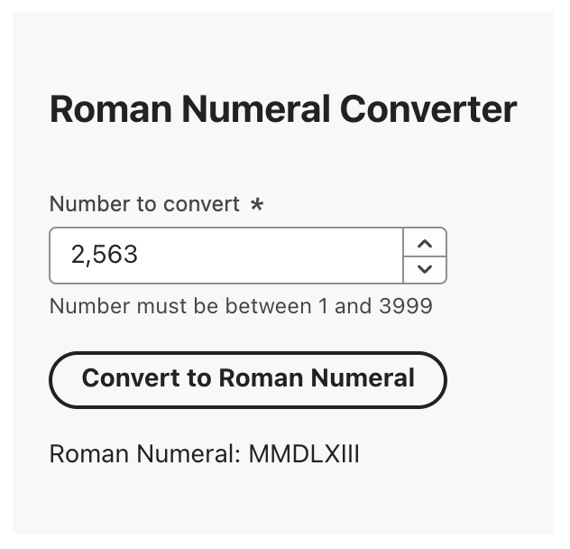

# roman-numeral-conversion

This is a demo app of various web development skills. The main functionality of the app takes a number supplied by the user, and outputs the roman numeral equivalent. The spec I used as a reference for roman numerals is [here](https://www.cuemath.com/numbers/roman-numerals/). Both the backend and frontend are written in TypeScript. The frontend runs in node with yarn as the package manager, and is a react app created with vite. It uses Adobe React Spectrum as the library for ui components. The Backend runs in deno and uses Oak to set up the rest api for returning the results of number conversion. Using docker compose makes it possible to seamlessly run both apps with one command, even though one runs in node, while the other runs in deno.

While developing this project I kept track of my progress and documented my thought process on this [trello board](https://trello.com/invite/b/67a649d2a1fd863a66b59bf7/ATTIc15d094febaf0ce228baabb1b7480da9B4794C74/roman-numeral-conversion).

## How to run

1. Clone this repo.
2. `cd` into the repo's directory
3. Run `docker compose up`
4. Access the frontend on `localhost:3000`

## Usage

There's a number field, put a number in that between 1 and 3999 and click "Convert to Roman Numeral". You'll see the output below the button, and a toast message confirming the number that was converted.

This project is divided into two main sections - `conversion-frontend` and `conversion-backend`:

## Conversion Frontend

The frontend is a react app built with vite and yarn. It was built with modularity in mind.

### Set up and run

1. `yarn install`
2. `yarn dev`

It can also be run using the Dockerfile:

`docker build -t conversion-frontend:latest . && docker run -it -p 3000:3000 conversion-frontend:latest`

### Testing

Tests are run with vitest. `yarn test` to run. `yarn lint` to check linting

## Conversion Backend

The backend is built and ran with deno.

### Set up and run

1. `deno install`
2. `deno run dev`

It can also be run using the Dockerfile:

`docker build -t conversion-backend:latest . && docker run -it -p 8080:8080 conversion-backend:latest`

### Testing

deno has built in testing and can be run with `deno test`. `deno lint` to check linting
